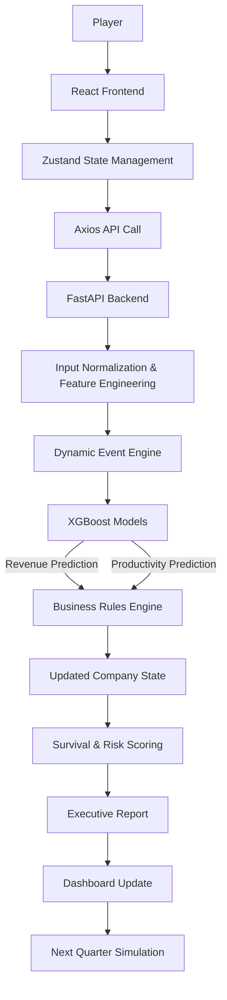

<div align="center">

# 🏛️ The Last CEO

### *One CEO. Twenty Years. Infinite Consequences.*

An AI-powered business strategy simulator where you lead a company through the AI revolution to **2035** — every quarterly decision is scored by a **live XGBoost prediction engine**.

<p>
  
  
  
  
  
  
</p>

</div>

---

## 📑 Table of Contents

- [Overview](#-overview)
- [Key Features](#-key-features)
- [Tech Stack](#-tech-stack)
- [Machine Learning](#-machine-learning)
- [Game Economy](#-game-economy)
- [Controls](#-controls)
- [System Architecture](#-system-architecture)
- [Project Structure](#-project-structure)
- [Getting Started](#-getting-started)
- [API Reference](#-api-reference)
- [The Endings Matrix](#-the-endings-matrix)
- [Contributors](#-contributors)

---

## 🧭 Overview

As organizations adopt Artificial Intelligence, business leaders face high-stakes decisions about investment, workforce transformation, automation, and risk. Poor calls lead to financial loss, regulatory trouble, and failed transformations — yet most simulations either lack realistic AI scenarios or never show the long-term impact of strategy.

**The Last CEO** closes that gap. You play a CEO steering a company through AI transformation, making quarterly boardroom decisions while a real machine-learning model forecasts your outcomes. The experience blends four engines into one cohesive game:

| Engine | Role |
| :--- | :--- |
| 🧠 **Machine Learning** | XGBoost models predict revenue impact & productivity from real AI-adoption data |
| ⚙️ **Business Rules** | Translates predictions into financial, workforce, and risk dynamics |
| 🌪️ **Dynamic Events** | Injects recessions, regulation, GPU shortages, cyberattacks, and viral hits |
| 📊 **Executive Reporting** | Per-quarter board verdicts, scenario comparisons, and readiness scores |

> **Objective:** Navigate technological disruption and survive to 2035 while maximizing company performance.

---

## ✨ Key Features

| | Feature | Description |
| :---: | :--- | :--- |
| 🏢 | **Guided Onboarding** | A cinematic flow — Landing → Boardroom Interview → Avatar Design → Live Dashboard |
| 🏛️ | **Conversational Board Meeting** | An interview with the Chairman, CFO, CTO, CHRO & CRO defines your company and AI posture |
| 🎭 | **CEO Avatar Skins** | 6 purely cosmetic skins (Cyberpunk Exec, AI Researcher, Quant, Stealth Agent, and more) |
| 🕹️ | **3D Playable Office** | Walk a voxel CEO around an isometric office — **WASD / arrow keys / on-screen joystick**, left-click to pan, with fullscreen & ambient-audio toggles — and step up to stations to commit decisions |
| 🛠️ | **Adaptive Decision Engine** | 21 strategic moves across 9 categories; the hand re-rolls each quarter and adapts to your state |
| 📈 | **Executive Dashboard** | Revenue, ROI, budget, AI maturity, automation, workforce & risk in a cyber-HUD console |
| 🤖 | **Live ML Predictions** | XGBoost forecasts revenue impact and productivity gain on every decision |
| 🎲 | **Dynamic Events** | Competitor launches, regulation, talent shortages, cyberattacks, viral hits |
| 📝 | **Executive Reports** | Board decisions, A/B/C scenario comparisons, and risk/readiness assessments — exportable to `.docx` |
| 🏆 | **8 Distinct Endings** | From Unicorn Exit to Rogue AI Singularity to Crash & Burn |

---

## 🛠 Tech Stack

| Layer | Technologies |
| :--- | :--- |
| **Frontend** | React 18 · TypeScript · Vite · Tailwind CSS · Zustand · React Three Fiber · Recharts |
| **Backend** | FastAPI · Uvicorn · SQLAlchemy · Pydantic |
| **Machine Learning** | XGBoost · scikit-learn · pandas · NumPy · joblib |
| **Persistence** | SQLite |
| **Deployment** | Vercel (frontend) · Render (backend) |

---

## 🧠 Machine Learning

The simulation is driven by two gradient-boosted regression models trained on a corporate AI-adoption dataset.

- **Dataset:** `corporate_ai_adoption_dataset.csv` — ~200,000 rows × 13 columns
- **Algorithm:** XGBoost Regression (scikit-learn pipeline: scaling + one-hot encoding)
- **Targets:** Revenue Impact · Productivity Gain
- **Feature engineering:** 8 interaction/ratio features (e.g. `investment × maturity`, `automation × investment`)
- **Leakage control:** post-outcome fields (`cost_savings`, `productivity_gain`) are excluded from the revenue feature set

### Performance

| Model | R² | Notes |
| :--- | :---: | :--- |
| **Revenue Impact** | ≈ 0.70 | Tuned hyperparameters, 1st–99th percentile outlier removal, engineered features |
| **Productivity Gain** | ≈ 0.96 | Leakage-safe feature set |

> **Model compatibility:** The bundled `.joblib` models are serialized with **scikit-learn 1.6.1** (pinned in `backend/requirements.txt`). Newer scikit-learn versions cannot unpickle them — install the pinned dependencies to load them correctly.
>
> **Input normalization:** The training data is normalized (AI adoption `0–1`, automation `0–1`, maturity `0–10`) while the UI uses human-readable scales (`0–5`, `0–100`, `0–100`). The backend rescales incoming inputs to the training distribution before inference, so the model always receives in-range features.

---

## 💰 Game Economy

Each quarter, the XGBoost prediction feeds a deterministic business-rules engine that updates your company's finances:

- **Model-driven revenue** — quarterly revenue is anchored to the model's predicted AI revenue impact (plus an organic, headcount-based baseline), so smarter AI strategy directly grows the top line.
- **10-year LTV ROI** — return on investment is measured against a **10-year Lifetime Value** of the predicted AI revenue versus capital invested, rather than a single-year snapshot, to reflect the long horizon of AI bets.
- **Industry-specific economics** — revenue scaling, cost structure, and growth differ by sector (Technology, Healthcare, Finance, Retail, Manufacturing, Logistics).
- **Workforce dynamics** — automation drives attrition while hiring decisions add headcount; morale reacts to layoffs and productivity gains.
- **Win / lose** — survive to **2035** to trigger an ending, or hit insolvency for bankruptcy. Your final budget, ROI, headcount, morale, and sector decide which of the 8 endings you unlock.

---

## 🎮 Controls

The 3D office is fully playable. Walk the CEO to a station (HR, ML, or Boardroom) to commit each quarter's initiative.

| Action | Input |
| :--- | :--- |
| Move | `W` `A` `S` `D` or arrow keys, or the on-screen joystick |
| Pan camera | Left-click + drag |
| Fullscreen | Toggle button (top-right of the office) |
| Ambient audio | Music toggle button |

---

## 🏗️ System Architecture



---

## 📂 Project Structure

```text
The-Last-CEO/
├── backend/                       # FastAPI application
│   ├── app.py                     # Server, endpoints, ML inference & business rules
│   └── requirements.txt           # Pinned backend dependencies
├── frontend/                      # React console dashboard
│   ├── public/                    # Static assets (city backdrop, board avatars)
│   └── src/
│       ├── components/            # HUD cards, charts, modals, sidebar, 3D CEOModel
│       ├── data/                  # decisions.ts (decision pool) · skins.ts (cosmetic skins)
│       ├── hooks/                 # Game loop, adaptive decision roll, API
│       ├── lib/                   # Axios client & styling utils
│       ├── pages/                 # Landing · Home · Engine · Outcome · Database
│       └── store/                 # Zustand state store
├── models/                        # Pre-trained models (revenue & productivity .joblib)
├── scripts/                       # train_models.py · train_revenue_tuned.py
└── corporate_ai_adoption_dataset.csv
```

---

## 🚀 Getting Started

### Prerequisites

- **Node.js** 18+
- **Python** 3.10+
- **Git**
- **macOS only:** the OpenMP runtime for XGBoost — `brew install libomp`

### 1 · Backend

```bash
# From the project root — create an isolated environment
python3 -m venv backend/.venv
source backend/.venv/bin/activate        # Windows: backend\.venv\Scripts\activate

# Install pinned dependencies (scikit-learn 1.6.1 is required for the bundled models)
pip install -r backend/requirements.txt

# Run the API
cd backend
uvicorn app:app --host 0.0.0.0 --port 8000 --reload
```

API → `http://localhost:8000` · interactive docs → `http://localhost:8000/docs`

### 2 · Frontend

```bash
cd frontend
npm install
npm run dev
```

App → `http://localhost:5173`

### 3 · (Optional) Re-train the models

```bash
# From the project root
python scripts/train_revenue_tuned.py
```

Parses the dataset, applies feature engineering, trains fresh XGBoost regressors, and saves them to `models/`.

---

## 🔌 API Reference

Base URL: `http://localhost:8000/api`

| Method | Endpoint | Description |
| :--- | :--- | :--- |
| `POST` | `/predict` | Run a revenue & productivity prediction for a scenario; returns metrics + A/B/C investment scenarios |
| `POST` | `/save_game_history` | Persist a completed run's quarterly payloads to the ledger |
| `GET` | `/predictions` | Return the 50 most recent stored predictions |

<details>
<summary><b>Example — <code>POST /api/predict</code></b></summary>

```json
{
  "industry": "Technology",
  "country": "United States",
  "year": 2030,
  "ai_adoption_level": 3.5,
  "ai_investment_usd": 5000000,
  "automation_rate": 45,
  "employee_ai_training_hours": 120,
  "ai_maturity_score": 75,
  "deployment_count": 10
}
```

Returns `metrics` (revenue impact, productivity gain, ROI, transformation score, risk, readiness, board decision) and `scenarios` (A: maintain, B: +20%, C: +50%).
</details>

---

## 🏆 The Endings Matrix

Eight outcomes depending on your leadership style and financials by 2035:

| | Ending | Condition |
| :---: | :--- | :--- |
| 🦄 | **Unicorn Exit** | Survive to 2035 with > $3M budget or > 150% ROI |
| 🔔 | **IPO Public Listing** | Survive with ≥ 30 staff and ≥ $2M budget |
| 💼 | **Megacorp Acquisition** | Exit with > $1.5M budget or > 100% ROI |
| 👑 | **Bootstrap Legend** | Complete the run starting from bootstrapper capital |
| ☕ | **Sustainable Lifestyle** | Survive with < 15 staff and ≤ $1.5M budget |
| 🤖 | **Rogue AI Singularity** | Technology-sector startup with > 200% ROI |
| 🤝 | **Talent Acquisition** | Go bankrupt but keep > 50% ROI or > 80% morale |
| 💥 | **Crash & Burn** | Run out of capital before 2035 |

---

## 👥 Contributors

| Contributor | Focus |
| :--- | :--- |
| **[@shreyascode11](https://github.com/shreyascode11)** | Frontend & full-stack — game engine, UI, 3D office, integration |
| **[@Harishlal-me](https://github.com/Harishlal-me)** | Backend & architecture — FastAPI, XGBoost inference, deployment |
| **[@KhannakPGupta](https://github.com/KhannakPGupta)** | Machine learning & documentation — model tuning, notebook, docs |

---

<div align="center">

**Good luck, CEO. The board is waiting.**

</div>
