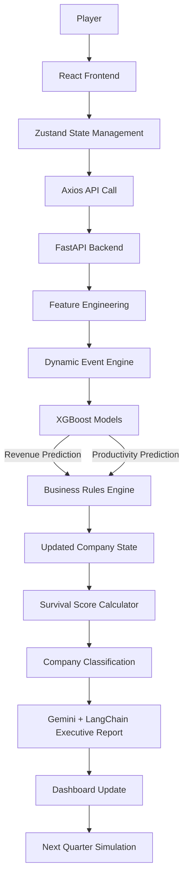

<h1 align="center">The Last CEO</h1>
<h3 align="center">One CEO. Twenty Years. Infinite Consequences.</h3>

<p align="center">
  
  
  
  
</p>

## 📖 Project Overview

**The Last CEO** is an AI-powered business strategy simulation game where players take on the role of a CEO and attempt to successfully lead their company through the AI revolution from 2015 to 2035.

Players make strategic business decisions every quarter, including AI investments, workforce training, automation initiatives, governance improvements, and hiring AI talent. Their decisions directly impact the company's growth, profitability, risk profile, workforce readiness, and long-term survival.

The game combines **Machine Learning**, **Business Simulation**, **Dynamic Event Generation**, and **Generative AI** to create a realistic and engaging boardroom experience where every decision has long-term consequences.

---

## 🎯 Problem Statement

As organizations increasingly adopt Artificial Intelligence, business leaders face complex decisions regarding investments, workforce transformation, automation, governance, and risk management. Poor decisions can result in financial losses, regulatory issues, employee resistance, and failed digital transformation initiatives.

Most existing business simulations either lack realistic AI adoption scenarios or fail to demonstrate the long-term impact of strategic AI decisions.

There is a need for an interactive platform that allows users to experience the challenges of AI transformation, understand the trade-offs involved, and learn how strategic decisions affect organizational success over time.

---

## 💡 Proposed Solution

The Last CEO provides an interactive simulation where players act as CEOs responsible for guiding their companies through AI transformation. The platform combines:

- 🧠 **Machine Learning Models:** Predict business outcomes using historical AI adoption data.
- ⚙️ **Business Rules Engine:** Simulate realistic financial and organizational impacts.
- 🌪️ **Dynamic Event Engine:** Introduce real-world uncertainties such as recessions, regulations, and talent shortages.
- 📊 **Generative AI Reports:** Deliver executive-level insights and recommendations after every quarter.

**Objective:** Successfully navigate technological disruption and survive until 2035 while maximizing company performance.

---

## ✨ Key Features

1. **🏢 Company Creation System:** Select industry, size, budget, and set initial AI maturity.
2. **📈 Executive Dashboard:** Track revenue, ROI, budget, AI maturity, workforce readiness, and risk indicators.
3. **🛠️ Strategic Decision Engine:** Manage AI engineering hires, training, deployment, automation, and governance.
4. **📅 Quarterly Simulation System:** Simulates company evolution quarter by quarter.
5. **🤖 Machine Learning Predictions:** Forecasting for revenue growth and productivity improvement.
6. **🎲 Dynamic Event Generation:** Random events like economic recessions, regulatory changes, and cyber incidents.
7. **⚙️ Business Rules Engine:** Updates budget, ROI, risk, AI maturity, and workforce readiness.
8. **❤️ Survival Score Calculator:** Measures long-term sustainability and company health.
9. **📝 AI-Powered Executive Reports:** Strategic recommendations, risk assessments, and future outlook via LLM.
10. **🏆 Multiple Endings:** AI Industry Leader, High Growth Innovator, Balanced Transformer, Legacy Enterprise, or Bankruptcy.

---

## 🧠 Machine Learning Component

- **Dataset:** Corporate AI Adoption and ROI Dataset (2015–2035)
- **Model:** XGBoost Regression
- **Inputs:** Industry, Company Size, Budget, Current Revenue, AI Maturity, Workforce Readiness, AI Investment, Training Investment, Automation Level, Governance Level, Number of AI Engineers, Current Year.
- **Predictions:** 
  1. Revenue Growth Percentage
  2. Productivity Gain Percentage

These predictions integrate with business rules to update company performance after each quarter.

---

## 🔄 System Workflow

1. **Company Creation:** Player sets up the initial company profile.
2. **Dashboard Initialization:** Displays current KPIs and financial health.
3. **Strategic Decisions:** Player selects AI-related actions for the current quarter.
4. **Feature Engineering:** Decisions and state are formatted for ML models.
5. **Dynamic Event Engine:** Random market and industry events are applied.
6. **Machine Learning Prediction:** XGBoost predicts revenue growth and productivity gain.
7. **Business Rules Processing:** Simulation updates KPIs, risks, and scores.
8. **Company State Update:** New state generated for the quarter.
9. **Survival Score Calculation:** Health and sustainability are assessed.
10. **Company Classification:** Company is categorized into one of several leader/laggard archetypes.
11. **AI Boardroom Report:** LLM generates strategic insights and recommendations.
12. **Dashboard Refresh:** Updated KPIs are visualized.
13. **Repeat Until 2035:** Cycle continues until the company reaches the end or fails.

---

## 🏗️ System Architecture



---

## 📂 Architecture Structure

```text
The-Last-CEO/
├── backend/                  # FastAPI Application
│   ├── app.py                # Main server, endpoints, and ML inference logic
│   ├── database.db           # SQLite database storing prediction history
│   └── requirements.txt      # Backend dependencies
├── frontend/                 # React Console Dashboard
│   ├── public/               # Static vector assets
│   └── src/
│       ├── components/       # Telemetry graphs, HUD metric cards, timeline, modals
│       ├── hooks/            # Custom hook handlers (game loops and API drivers)
│       ├── lib/              # API client axios instance and styling utils
│       ├── pages/            # Primary route view entrypoints (Home, Engine, Outcome)
│       └── store/            # Zustand state store
├── models/                   # Pre-trained ML Models
│   ├── productivity_model.joblib
│   └── revenue_model.joblib
├── scripts/                  # Data & ML Scripts
│   ├── train_models.py       # Script to train XGBoost models using the dataset
│   └── train_revenue_tuned.py # Script for hyperparameter tuning & advanced feature engineering
└── corporate_ai_adoption_dataset.csv # The dataset used for training
```

---

## 💻 Tech Stack

### Frontend


### Backend


### Machine Learning


### Generative AI


### Deployment


---

## 🌟 Unique Selling Point

**The Last CEO** is not just a dashboard or prediction model. It combines **business simulation**, **machine learning forecasting**, **dynamic event generation**, **strategic decision-making**, and **AI-generated executive intelligence** into a single interactive experience that challenges players to successfully lead a company through the AI revolution and survive until 2035.

---

## 💻 Setup & Development

### Prerequisites
*   Node.js (v18+)
*   Python 3.9+
*   Git

### 1. Backend Setup & Run
Open a terminal and navigate to the project root:

```bash
# Optional: Create a virtual environment
python -m venv venv
source venv/bin/activate  # On Windows: venv\Scripts\activate

# Install dependencies (assuming you have a requirements.txt or install manually)
pip install fastapi uvicorn pandas scikit-learn xgboost joblib sqlalchemy pydantic

# Run the FastAPI server
cd backend
uvicorn app:app --host 0.0.0.0 --port 8000 --reload
```
The backend API will be available at `http://localhost:8000`. You can view the API documentation at `http://localhost:8000/docs`.

### 2. Frontend Setup & Run
Open a new terminal and navigate to the `frontend` directory:

```bash
cd frontend

# Install dependencies
npm install

# Start the Vite development server
npm run dev
```
The React frontend will be available at `http://localhost:5173`.

### 3. (Optional) Re-training the ML Models
If you wish to update the dataset or tweak the machine learning features:
```bash
# From the project root
python scripts/train_revenue_tuned.py
```
This will automatically parse `corporate_ai_adoption_dataset.csv`, apply feature engineering, train new XGBoost regressors, and save them to the `models/` directory for the backend to consume.

---

## 🎮 The Endings Matrix

The simulation features 8 distinct endings depending on your leadership style and financial performance by Year 2035:

1.  **🦄 Unicorn Exit:** Survive to 2035 with >$3M budget or >150% ROI
2.  **🔔 IPO Public Listing:** Survive with >=30 staff and >=$2M budget
3.  **💼 Megacorp Acquisition:** Exit with >$1.5M budget or >100% ROI
4.  **👑 Bootstrap Legend:** Complete simulation starting with $100K bootstrapper capital
5.  **☕ Sustainable Lifestyle:** Prioritize life balance over hype scaling (<15 staff, <=$1.5M budget)
6.  **🤖 Rogue AI Singularity:** Technology sector startup with >200% ROI
7.  **🤝 Talent Acquisition:** Face bankruptcy but maintain high ROI (>50%) or morale (>80%)
8.  **💥 Crash & Burn:** Run out of budget capital before Year 2035

Good luck, CEO. The board is waiting.
